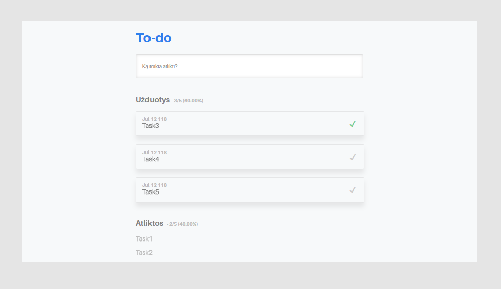

## To-Do

Simple page without style or script frameworks.

- Exercise is showing tasks in task list;
  - Every task has:
    - title;
    - status (done/undone;
    - date (format: MMM DD YYYY);
- Representing the number of (done/undone)tasks, showing percentage value;
- Page is responsive;

Page view:

